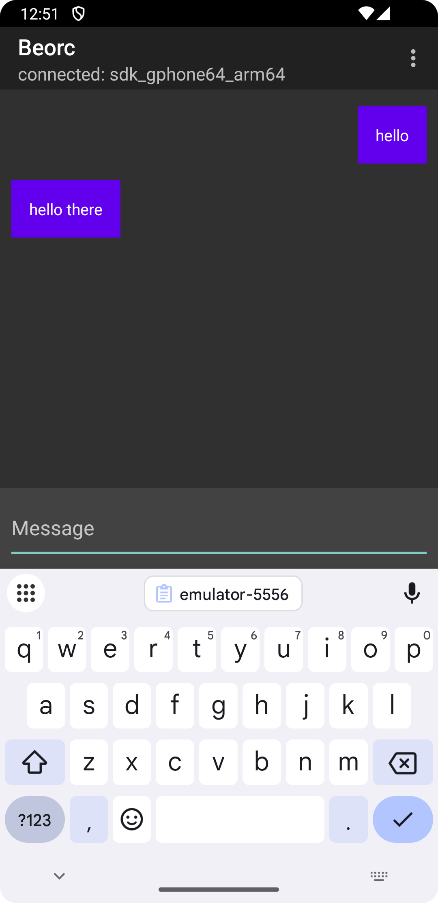
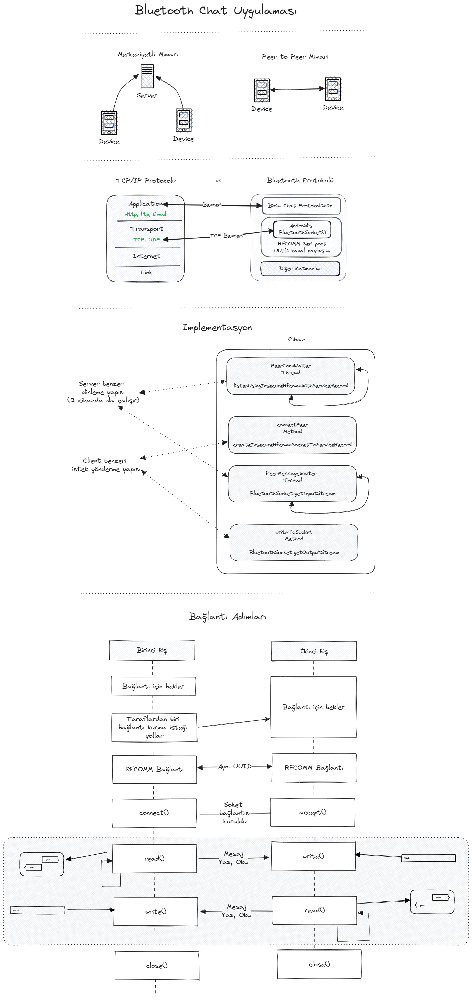

# BeorcChat

BeorcChat is a peer-to-peer messaging application designed to showcase multithreaded, text-based communication over Bluetooth sockets on Android.

|  |
| -------------------------------- |

## Diagrams in Turkish

You can check out the diagrams used in the presentation:

 
